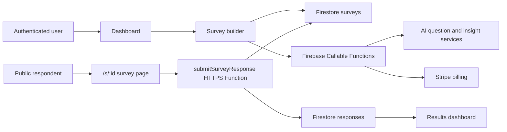

# SurveyGo


SurveyGo is a modern survey builder for creating, publishing, and analyzing custom surveys. It combines a dashboard for managing surveys, a drag-and-drop builder, public respondent forms, response analytics, AI-assisted question generation, and plan-based feature access.

This project was built as a portfolio-ready SaaS application with an emphasis on product flow, Firebase-backed data modeling, protected routes, public survey submission, and production-oriented UI polish.

## Product Overview

SurveyGo helps users move through the full survey lifecycle:

- Create and manage surveys from a dashboard.
- Build forms with multiple question types.
- Customize survey design and respondent settings.
- Publish surveys and share public links, QR codes, embeds, or email invitations.
- Collect responses through public respondent pages.
- Review results, charts, raw submissions, exports, and AI insights.
- Manage account, plan, billing, and notification preferences.

## Screenshots

Add screenshots or GIFs here for the strongest portfolio presentation:

- Dashboard survey list/grid view.
- Survey builder with question canvas and edit panel.
- Respondent-facing survey page.
- Results dashboard and AI insights.

Example:

```md


```

## Core Product Flows

### 1. Create a Survey

Users can start from the dashboard, create a new survey, and immediately enter the builder experience. Surveys are stored in Firestore and scoped to the authenticated user.

### 2. Build and Customize

The builder supports common survey question types, including short answer, long answer, multiple choice, checkbox, dropdown, rating scales, grids, date, and time inputs. Users can edit question text, options, validation-style settings, required states, survey design, and respondent-facing behavior.

### 3. Add Logic and AI Assistance

SurveyGo includes conditional logic tooling and AI-assisted question generation. AI features are gated by subscription plan limits and exposed through Firebase Callable Functions.

### 4. Publish and Share

Published surveys become available through public `/s/:id` respondent links. The share page supports direct links, QR codes, embed snippets, social sharing, and email invitations.

### 5. Collect Responses

Respondents complete public surveys without needing dashboard access. Responses are submitted through a Firebase HTTPS Function, which validates survey status, enforces response limits, stores answers, and increments survey response counts.

### 6. Analyze Results

Survey owners can view response volume, per-question charts, individual submissions, exports, and AI sentiment insights for open-ended responses.

## MVP Technical Choices

| Area | Choice | Why |
| --- | --- | --- |
| Frontend | React + Vite + TypeScript | Fast development loop, typed components, and production build performance. |
| Styling | Tailwind CSS + local UI components | Flexible design system with reusable primitives and responsive UI control. |
| Auth | Firebase Authentication | Managed sign-in, persistence, and protected dashboard routes. |
| Database | Cloud Firestore | Real-time survey and response data with simple document modeling. |
| Backend | Firebase Functions | Server-side response submission, billing, email, and AI workflows. |
| Billing | Stripe | Plan-based limits and customer portal/checkout flows. |
| AI | Firebase Callable Functions | Keeps AI calls behind authenticated/server-side boundaries. |
| Testing | Vitest + React Testing Library | Component-level regression tests for core UI flows. |

## Architecture Overview

SurveyGo is organized around a client-heavy React app with Firebase services behind it.



### Frontend

- `src/app/App.tsx` defines public, guest, protected, dashboard, builder, and respondent routes.
- `src/app/components/DashboardHome.tsx` manages survey listing, sorting, pagination, and survey actions.
- `src/app/components/DashboardBuilder.tsx` contains the primary builder flow.
- `src/app/components/BuilderShare.tsx` handles survey publishing and sharing.
- `src/app/components/BuilderResults.tsx` renders analytics, response review, exports, and insights.
- `src/app/components/SurveyRespondentPage.tsx` renders the public survey-taking experience.

### Data Layer

- `src/types/survey.ts` defines survey, question, settings, response, and user preference types.
- `src/lib/firestore.ts` contains Firestore reads, writes, subscriptions, and conversions.
- `src/hooks/useSurveys.ts` and `src/hooks/useResponses.ts` wrap Firestore operations with TanStack Query.

### Backend Functions

- `functions/src/responses/submitResponse.ts` handles public response submission.
- `functions/src/ai/generateQuestions.ts` generates survey questions.
- `functions/src/ai/analyzeSentiment.ts` analyzes open-ended responses.
- `functions/src/stripe/*` handles checkout, customer portal, and webhook events.
- `functions/src/invitations/sendSurveyInvitation.ts` sends survey invitations.

## Feature Highlights

- Authenticated dashboard and protected routes.
- Survey creation, duplication, renaming, deletion, sorting, and pagination.
- Grid and list survey management views.
- Drag-and-drop question ordering.
- Multiple question types and per-question editing controls.
- Conditional logic and branching-ready survey model.
- Design customization for fonts, colors, backgrounds, and respondent presentation.
- Public respondent flow with required-field validation and draft autosave.
- Share links, QR codes, embeds, social sharing, and email invitations.
- Results overview, response charts, individual response review, and exports.
- AI question generation and AI sentiment insights.
- Plan-based feature limits for Basic, Standard, and Professional tiers.
- Stripe checkout, billing portal, and webhook handling.

## Local Development

### Prerequisites

- Node.js 20+
- npm
- Firebase project with Auth, Firestore, Storage, Hosting, and Functions enabled
- Stripe account if testing billing flows

### Install

```bash
npm install
```

### Run the Web App

```bash
npm run dev
```

The app will run on the local Vite URL printed in the terminal, usually `http://localhost:5173`.

### Run Firebase Functions Locally

From the `functions` directory:

```bash
npm install
npm run build
```

Use the Firebase Emulator Suite if you want local Auth, Firestore, Functions, or Hosting emulation.

## Environment Variables

Create a local `.env` file for the Vite app:

```bash
VITE_FIREBASE_API_KEY=
VITE_FIREBASE_AUTH_DOMAIN=
VITE_FIREBASE_PROJECT_ID=
VITE_FIREBASE_STORAGE_BUCKET=
VITE_FIREBASE_MESSAGING_SENDER_ID=
VITE_FIREBASE_APP_ID=
VITE_SUBMIT_FUNCTION_URL=
```

Firebase Functions also rely on runtime configuration/environment for production services such as Stripe, email, app URL, and AI providers. Do not commit secrets to the repository.

Known server-side environment/config values include:

```bash
APP_URL=
GCLOUD_PROJECT=
GCP_PROJECT=
```

Add Stripe and AI provider secrets through Firebase Functions config or your deployment environment.

## Testing and Quality Checks

```bash
npm test
npm run type-check
npm run lint
npm run build
```

Useful focused checks during development:

```bash
npm test -- src/app/components/BuilderResults.test.tsx
npm test -- src/lib/planLimits.test.ts
```

## Deployment

SurveyGo is designed for Firebase Hosting and Firebase Functions.

Typical production flow:

```bash
npm run build
firebase deploy
```

Before deploying, confirm:

- Firebase web app environment variables are configured.
- Firestore security rules are reviewed.
- Storage rules are reviewed.
- Functions secrets/config are set.
- Stripe webhook endpoint is configured.
- Public survey submission URL is set through `VITE_SUBMIT_FUNCTION_URL`.
- Production app URL is configured for emails and shared links.

## Roadmap and Known Limitations

- Real completion-rate tracking needs response-level completion metadata instead of deriving completion from response count.
- Response editing requires an edit-token or authenticated respondent flow.
- Account switching stores known accounts locally, but Firebase still requires re-authentication to switch users.
- PDF exports can be expanded with richer formatting.
- AI insights can be expanded beyond sentiment into trend detection, summaries by segment, and recommended follow-up questions.
- More survey templates and industry-specific starting points would improve first-run UX.

## Repository Context

This repository began from a Figma-generated design bundle and was expanded into a functional Firebase-backed SaaS prototype. The current implementation focuses on end-to-end product behavior and practical production concerns rather than a static mockup.

Original design reference:

https://www.figma.com/design/bO4eS9AeBrq12ZLGUsn892/SurveyGo-App-Design

## License

No license has been specified yet. Add one before making the repository open source.
